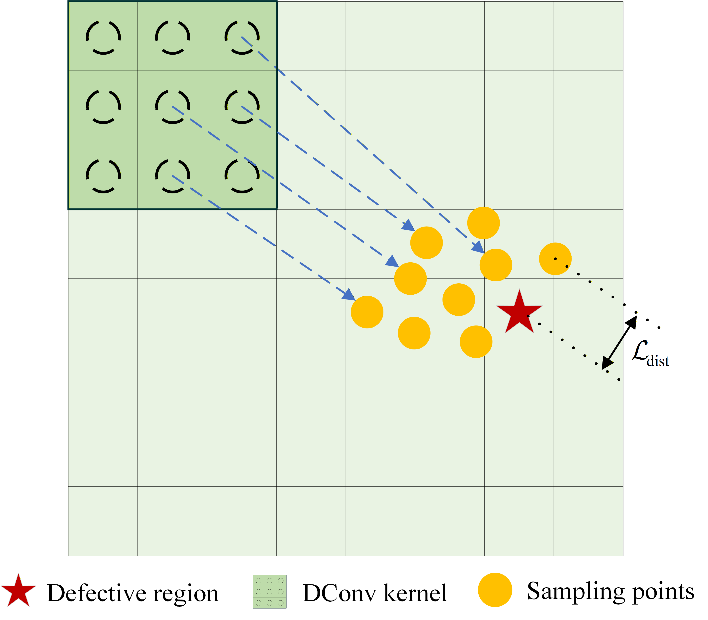

# Progressive Deep Feature Learning Network Based on Fault-Aware Deformable Convolution and Its Application in Railway Defect Visual Inspection
## 1. Abstract

Visual inspection has become popular for railway track fault identification. However, the current vision models still have limitations in identifying defects in complex backgrounds due to the insufficient integration of local fault features with global context information. Facing the gap, Progressive Deep Feature Learning Network Based on Fault-Aware Deformable Convolution (PFDCNet) is proposed, which integrates a Residual Network-50 (ResNet-50) branch for capturing local details and an Enhanced Vision Transformer (EVT) branch for global context modeling. In the proposed EVT branch, the Feature Selection (FS) module based on self-attention filters out background noise and generates discriminative multi-scale features through feature map reconstruction, enabling alignment with the ResNet-50 branch. Meanwhile, for defect localization, a Cross-Attention (CA) is introduced in EVT to correlate the classification (CLS) token with ResNet-50 feature maps, locating the key fault-related areas and compensating for the information loss caused by the feature selection. Finally, a Feature Fusion Pyramid Network (FFPN) is proposed to fuse the aligned features from two branches and utilize CA-derived fault regions to guide deformable convolutions through an offset loss, which minimizes the distance between the sampling points and predicted fault centers. Extensive experiments on real railway defect datasets and other three public datasets demonstrate the outperformance of PFDCNet over several state-of-the-art models for practical railway fault monitoring.

## 2. FrameWork & Mechanism


Fig.1 Fault-aware deformable convolution sampling mechanism. DConv denotes deformable convolution. By minimizing the offset loss, the DConv adaptively adjusts its sampling points to focus on defective regions.

## 3. Environment Setup
- **Python**: 3.8+
- **PyTorch**: 2.2+  
- **CUDA**: 11.8+  


## 4. Dataset Preparation
The dataset is organized as follows:
```
dataset/
├── train/
│   ├── Class1/
│   └── Class2/
|   └── ...
├── val/
│   ├── Class1/
│   └── Class2/
|   └── ...
└── test/
    ├── Class1/
    └── Class2/
    └── ...
```

Once prepared, you can directly import and load the model file in your own scripts:
```
from PFDCNet import PFDCNet,TrainStage

device = torch.device("cuda" if torch.cuda.is_available() else "cpu")
model = PFDCNet(num_classes=num_classes).to(device)
model.set_train_stage(TrainStage.STAGE3)
```

## Publication

If you find this work useful in your research, please consider citing our paper:

**Progressive deep feature learning network based on fault-aware deformable convolution and its application in railway defect visual inspection** *Engineering Applications of Artificial Intelligence*, Volume 167, 2026, 113783.

[[Full Paper (Free access until March 04, 2026)]](https://authors.elsevier.com/c/1mR8V3OWJ9GFK3) | [[ScienceDirect)]](https://doi.org/10.1016/j.engappai.2026.113783)

### BibTeX
```bibtex
@article{SHEN2026113783,
  title = {Progressive deep feature learning network based on fault-aware deformable convolution and its application in railway defect visual inspection},
  journal = {Engineering Applications of Artificial Intelligence},
  volume = {167},
  pages = {113783},
  year = {2026},
  issn = {0952-1976},
  doi = {10.1016/j.engappai.2026.113783},
  url = {https://www.sciencedirect.com/science/article/pii/S0952197626000643},
  author = {Jiahao Shen and Sheng Xiang and Penghua Li and Jie Hou and Yongfu Li and Yi Qin}
}
